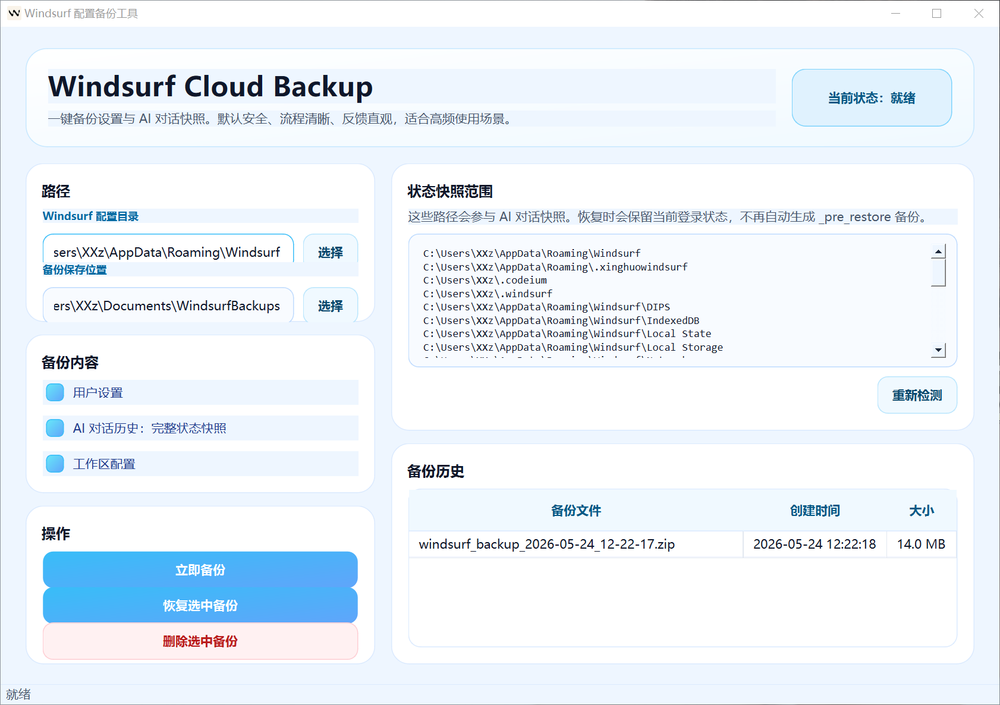
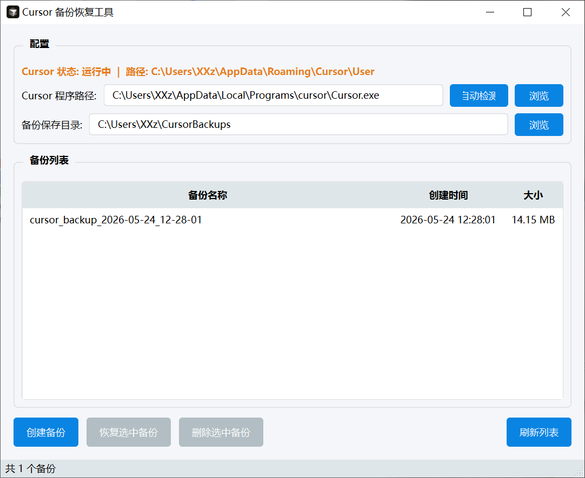

# Cursor & Windsurf Backup Tools

A desktop backup toolkit for **Cursor** and **Windsurf** configuration/data, built with **Python + PySide6**.

## Project Structure

- `cursor-backup-tool/`  
  Cursor backup GUI app source code
- `windsurf-backup-tool/`  
  Windsurf backup GUI app source code
- `Cursor备份工具.exe`  
  Prebuilt Cursor backup executable (root-level artifact)

## Requirements

- Python 3.10+
- Windows (recommended, based on current packaging and artifacts)

## Install Dependencies

Install each app's dependencies in its own environment.

### Cursor backup tool

```bash
cd cursor-backup-tool
pip install -r requirements.txt
```

### Windsurf backup tool

```bash
cd windsurf-backup-tool
pip install -r requirements.txt
```

## Run from Source

### Cursor backup tool

```bash
cd cursor-backup-tool
python main.py
```

### Windsurf backup tool

```bash
cd windsurf-backup-tool
python main.py
```

## Build

This repository already contains spec/build scripts and build artifacts for packaging.

Examples:

- Cursor tool: `cursor-backup-tool/build.ps1`, `cursor-backup-tool/build.spec`
- Windsurf tool: `windsurf-backup-tool/*.spec`

You can package executables using PyInstaller with the corresponding spec file.

## UI Preview

### Windsurf Backup Tool



- 提供配置路径与备份目录选择
- 支持一键备份、恢复、删除备份
- 展示状态快照范围与备份历史

### Cursor Backup Tool



- 自动检测 Cursor 程序与用户配置路径
- 支持创建备份、恢复备份、删除备份
- 支持备份列表刷新与容量展示

## Notes

- This repository currently includes generated build artifacts (`build/`, `dist/`, and `.pyc` in some folders).
- If you want a cleaner source-only repository, add a `.gitignore` and remove generated artifacts in a follow-up change.